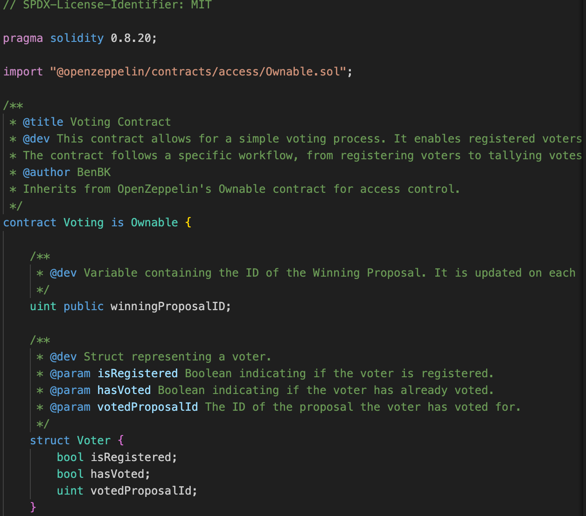
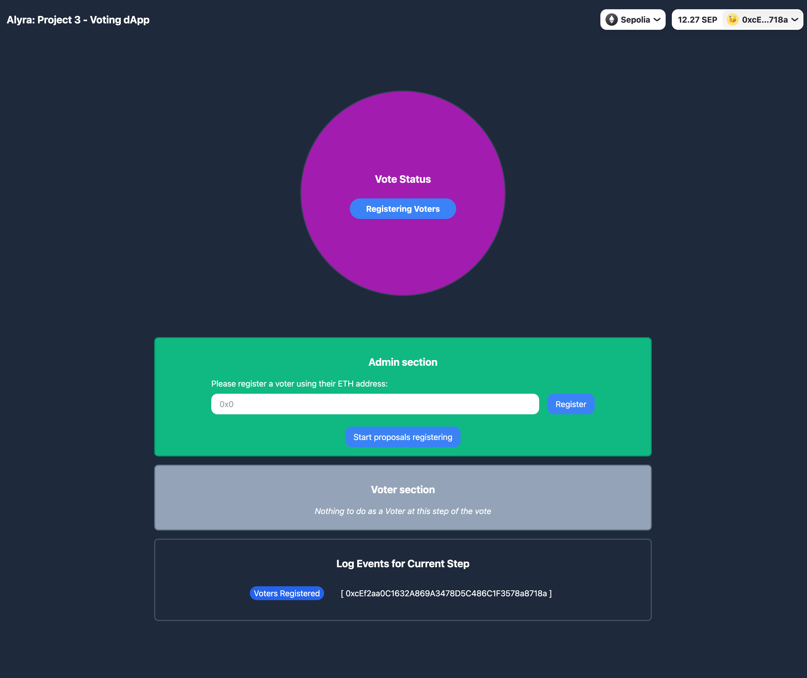

# ⚡️ alyra-project3 - dApp de vote

## :point_right: Enoncé

Oui oui, nous allons repartir du défi “Système de vote” #2 !

Alors depuis, vous avez vu la partie sécurité des smart contracts ainsi que la partie DApp.

Vous en doutez certainement, à ce stade vous allez revoir la sécurité et l’optimisation de votre smart contract et créer une DApp qui répond aux spécifications citées ci-dessous et déployer votre DApp sur Heroku et Github Pages, comme vu dans le chapitre 4.

### Spécifications

Votre Dapp doit permettre :

- l’enregistrement d’une liste blanche d'électeurs.
    à l'administrateur de commencer la session d'enregistrement de la proposition.
- aux électeurs inscrits d’enregistrer leurs propositions.
    à l'administrateur de mettre fin à la session d'enregistrement des propositions.
- à l'administrateur de commencer la session de vote.
    aux électeurs inscrits de voter pour leurs propositions préférées.
- à l'administrateur de mettre fin à la session de vote.
- à l'administrateur de comptabiliser les votes.
- à tout le monde de consulter le résultat.

### Les recommandations et exigences

- Votre code doit être optimal.
- Votre Dapp doit être sécurisée.
- Vous pouvez utiliser la techno de front que vous préférez utilisant du JavaScript ou TypeScript.

### A rendre

- Lien vers votre répertoire Github, comprenant:
  - Lien vers vidéo démo des fonctionnalités de votre Front.
  - Le lien vers un déploiement public de votre dapp (Heroku / - GhPages, AWS, Vercel...)

## :point_right: Solution proposée

### Groupe de travail

Le groupe de travail est constitué de **Maxime AUBURTIN**.

### Smart Contract

#### 1. Correction de la faille Gas DOS Limit

Au lieu de chercher la proposition vainqueur dans la fonction TallyVotes, j'ai pris la décision de modifier la fonction setVote pour directement déterminer le vainqueur à cette étape. A chaque fois qu'il y a un nouveau vote, on le compare au gagnant. Si il est supérieur ou égal la proposition qui vient d'être votée remplace la proposition gagnante.

```js
function setVote( uint _id) external onlyVoters {
    ... // Previous instructions

    // We check if this newly voted proposition has more vote than the present
    // winner and if that's the case we replace the winningProposalID
    if (proposalsArray[_id].voteCount >= proposalsArray[winningProposalID].voteCount) {
        winningProposalID = _id;
    }

    ... // Following instructions
}
```

La fonction TallyVotes a été conservée mais ne fait plus rien si ce n'est de changer l'étape du workflow et émettre un événement _WorkflowStatusChange_:

```js
function tallyVotes() external onlyOwner {
       require(workflowStatus == WorkflowStatus.VotingSessionEnded, "Current status is not voting session ended");       
       workflowStatus = WorkflowStatus.VotesTallied;
       emit WorkflowStatusChange(WorkflowStatus.VotingSessionEnded, WorkflowStatus.VotesTallied);
    }
```

#### 3. Natspec

Le contrat [Voting.sol](./backend/contracts/Voting.sol) a été entièrement commenté en utilisant la norme Natspec.



#### 4. Slither

J'ai également créé une [Github Action](./.github/workflows/slither.yml) pour faire tourner Slither sur le code du Smart Contract. Vous pouvez consulter les résultats [ici](https://github.com/manthis/alyra-project3/actions/workflows/slither.yml). Je n'ai pas corrigé les problèmes remontés par ce dernier puisque nous n'avions pas le droit de modifier le contrat mais il faudrait sans doute s'en préoccuper.

### Frontend

Nous avons conçu une application Frontend pour manipuler le contract [Voting.sol](./backend/contracts/Voting.sol) créé par Alyra.

Ci-dessous une capture d'écran de cette dernière.



### Stack technique de la solution

- **Backend**:
  - Solidity 0.8.20
  - Hardhat 2.19.4
  - Ethers 6.4.0
- **Fontend**:
  - Next 14.1.0
  - Wagmi 1.4.13
  - Viem 1.21.4
  - RainbowKit 1.3.3
  - TailwindCSS 3.3.0

### Lien vers la vidéo de démonstration

Voici le lien vers la vidéo de démonstration de l'application: [ici](https://www.loom.com/share/af5bf553e2814a11935c63d0515d8a33), ainsi qu'un petit erratum par [ici](https://www.loom.com/share/d77310c5421646b680e755b1ffeeef4b) car j'ai fait un dernier changement et je voulais insister sur certains détails.

La démonstration a été réalisée sur le réseau Hardhat de développement pour que l'application soit plus rapide et tenir dans les 5 minutes imparties.

### Lien vers l'application

Le smart contract a été déployé sur Sepolia: [Etherscan](https://sepolia.etherscan.io/address/0x158E058d7351a1AF59A0E5b8cCcFdF78d6c5e266).

Le frontend a été déployé sur Vercel: [alyra-project3-sooty.vercel.app](https://alyra-project3-sooty.vercel.app)
